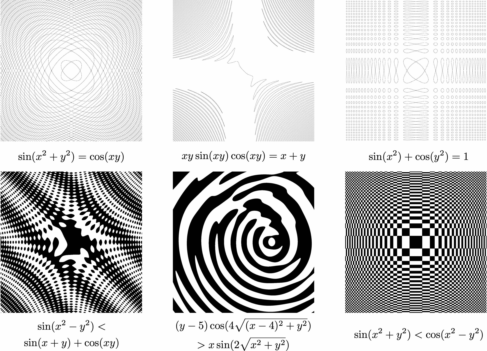

# plot-2d-interval
2D plotting by interval algorithm

二维隐函数绘图，使用基于区间的算法。用C++实现。具体原理请参考下面两个链接。

Plotting 2D graphs using an interval-based algorithm, implemented in C++. The algorithm is explained in detail in the following links:

1. https://zhuanlan.zhihu.com/p/1988701719459284501 (Chinese)
2. https://www.dgp.toronto.edu/public_user/mooncake/papers/SIGGRAPH2001_Tupper.pdf (English)

使用方法：编译main.cpp，interval.cpp并运行输出用于绘图的数据，然后用plot.py进行绘图。

Usage: Compile main.cpp, interval.cpp and run to get plot data. Use plot.py to get figure.

目前还有一些问题，但暂时不想去修它们了。比如对于函数y=ln(x)，靠近渐进线的部分有缺失，详见gallery/18.png。

There are some artifacts, but I currently don't have time to fix them (and don't know how). For instance, some part of the graph for function y=ln(x) is missing (please see gallery/18.png).

效果：（使用知乎文章里的函数）

Some examples:

