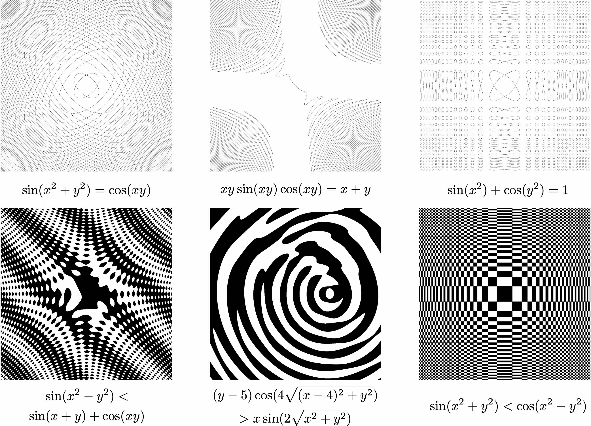

# plot-2d-interval
2D plotting by interval algorithm

二维隐函数绘图，使用基于区间的算法。用C++实现。具体原理请参考下面两个链接。

Plotting 2D graphs using an interval-based algorithm, implemented in C++. The algorithm is explained in detail in the following links:

1. https://zhuanlan.zhihu.com/p/1988701719459284501 (Chinese)
2. https://www.dgp.toronto.edu/public_user/mooncake/papers/SIGGRAPH2001_Tupper.pdf (English)

## 使用方法 / Usage

编译 `main.cpp` 和 `interval.cpp`，运行生成绘图数据，然后使用 `plot.py` 生成图片。

Compile `main.cpp` and `interval.cpp`, run the executable to generate plot data, and then use `plot.py` to generate the figures.

## 效果展示 / Results

以下示例使用知乎文章中的函数：

The following examples use functions from the Zhihu article:

## 参数设置 / Parameters

### 子像素细分深度 / Subpixel subdivision depth

通过 `plotter.plot(depth)` 设置子像素细分深度，默认为 8。深度越大，越能保留紧靠定义域边界或渐近线的细节，但最坏情况下计算量会随深度指数增长。降低深度可以加快复杂函数的绘制，但可能丢失 `y=1/x²` 等函数的尾部；使用 0 可关闭子像素细分。

Set the subpixel subdivision depth with `plotter.plot(depth)`; the default is 8. A larger value preserves more detail close to domain boundaries or asymptotes, but its worst-case cost grows exponentially. Lowering the depth can speed up complex plots, but may omit tails of functions such as `y=1/x²`; use 0 to disable subpixel subdivision.
